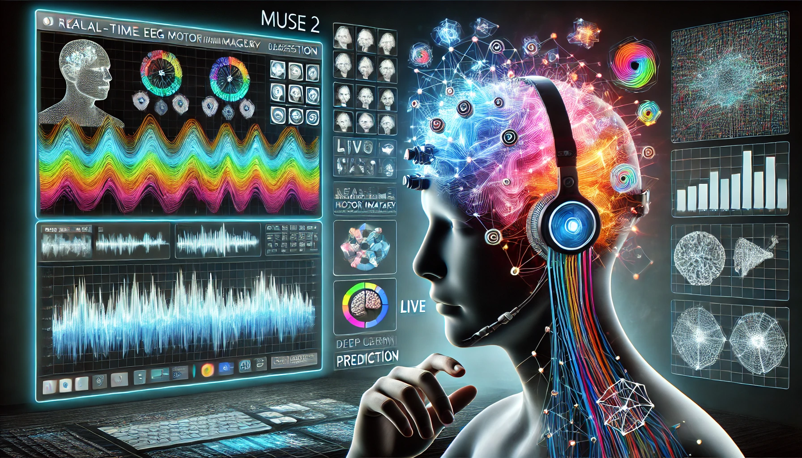

# Muse Motor Imagery Classification - EEGNet



Ce projet utilise des signaux EEG pour la classification de l'imagerie motrice en temps réel. Il fonctionne avec un casque Muse 2 pour capturer des données EEG, les traiter et effectuer des prédictions en temps réel grâce à un modèle de deep learning.

## Fonctionnalités

- **Acquisition des données EEG** en temps réel via `pylsl`.
- **Prétraitement des données EEG** avec `MNE`.
- **Prédictions en temps réel** à l'aide d'un modèle PyTorch.
- **Simulation de touches directionnelles** (haut, bas, gauche, droite) en fonction des prédictions.

## Technologies utilisées

- **Python 3.12**
- **PyTorch** : Chargement et exécution du modèle de deep learning.
- **pylsl** : Gestion des flux EEG.
- **MNE** : Traitement et manipulation des signaux EEG.
- **keyboard** : Simulation de touches clavier.
- **NumPy** et **Pandas** : Manipulation des données.

## Prérequis

1. Installer **Python 3.10** ou une version supérieure.
2. Installer les les dépendances nécessaires via `pip` :
   ```bash
   pip install -r requirements.txt
   ```
## Installation

1. Clonez le dépôt dans votre environnement local :
```bash
git clone https://github.com/Infinityy1001/EEGNet.git
cd Muse-MotorImageryClassification
```

2. Connectez et démarrez votre casque Muse 2.

3. Exécutez le script principal :

```bash
python prediction_in_real_time.py.py
```
    
## Contributions

Les contributions sont les bienvenues ! Si vous souhaitez améliorer ce projet, veuillez soumettre une issue ou une pull request.
Licence

